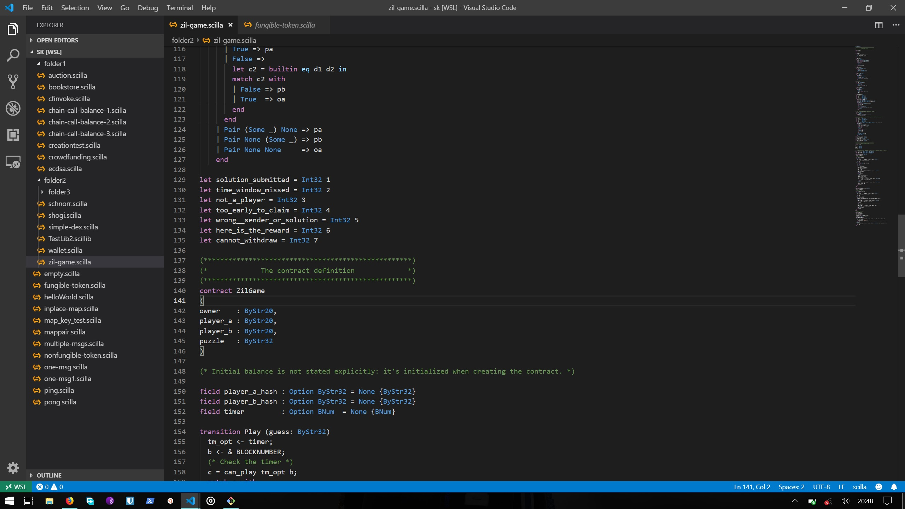

# Scilla for VSCode

Scilla, short for `Smart Contract Intermediate-Level Language`, is an intermediate-level smart contract language being developed for [Zilliqa](https://zilliqa.com/). Scilla has been designed as a principled language with smart contract safety in mind.
‍
## To learn more about Scilla;
- [Visit the Scilla website](https://scilla-lang.org/) for an overview.
- Or for comprehensive guide, [read the official docs](https://scilla.readthedocs.io/en/latest/index.html).

## Installation 
- [Option 1] Install it from [VS Marketplace](https://marketplace.visualstudio.com/items?itemName=as1ndu.scilla)
- [Option 2]  Get the `.visx` file from the [releases tab](https://github.com/as1ndu/scilla/releases)

## Usage & Setup

### To use   Casfflow analysis
- Use CF via search blade `Ctlr + P`, then press `Ctrl + >` for PC &  Use CF via search blade `Cmd + P`, then press `Cmd + >` for MacBooks
- Type in Scilla then select `Scilla Cash Flow Analyser`

### MacOS & Linux
These steps are requires to run the Scilla linter & Cash flow analysis, 

1. Download Scilla interpreter, [install it](https://github.com/Zilliqa/scilla) ( build the binaries)
2. Test it & ensuer it works as [instructed](https://github.com/Zilliqa/scilla/blob/master/INSTALL.md)
3. Add the directory Scilla binaries to your `PATH`. This should be an absolute directory.
```bash
$ cd ~
$ nano ~/.bashrc
$ export PATH="/path/to/scilla/binaries:$PATH"
```
4. Add the `SCILLA_STDLIB_PATH` variables. The value should be also the absolute 
```bash
$ cd ~
$ nano ~/.bashrc
$ export SCILLA_STDLIB_PATH="/path/to/scilla/standard/library/scilla-0.3.0/src/stdlib"
```

### A note for Windows users
1. Install Windows Subsystem for Linux (WSL)
2. Install the [WSL VScode Extension](https://marketplace.visualstudio.com/items?itemName=ms-vscode-remote.remote-wsl) (Yes, its different from 1 above)
3. Test it too & [ensure it works](https://code.visualstudio.com/docs/remote/wsl)
4. Follows steps 1 to 4 for MacOS/Linux via the _ Windows Subsystem for Linux (WSL) terminal_ (i.e installing the scilla interpreter, adding `SCILLA_STDLIB_PATH` & the scilla binaries to your `PATH` )
5. Open the scilla code you intend to work on in [WSL mode](https://code.visualstudio.com/docs/remote/wsl)
6. You can now install the scilla plugin from the [market place](https://marketplace.visualstudio.com/items?itemName=as1ndu.scilla) (with WSL mode enabled)

> P.S VSCodes's WSL mode on windows keeps a separate collection of extension i.e the some features of the extension _may not work outside WSL mode._


## Features

Features are still a work in progress, as outlined in the roadmap below;

- [X] Syntax Coloring
    

- [ ] Support on Github
    - Pending

- [X] Icons for Scilla files
    

- [X] Code folding
    

- [X] Auto-Completion
    

- [X] Code Snippets
    

- [ ] Formatting
    - pending

- [X] Hover Information
    

- [x] Linter (syntax errors & warnings)
    - Errors & Warnings
    
    

- [x] Cash Flow Analysis
    - Use CF via search blade `Ctlr + P`, then press `Ctrl + >` for PC &  Use CF via search blade `Cmd + P`, then press `Cmd + >` for MacBooks
    

    - Panel showing results of cashflow analysis
    


## Requirements

Latest version of [Visual Studio Code (VSCode)](https://code.visualstudio.com/) i.e VSCode Engine 1.34.0 & above

## Screenshot



